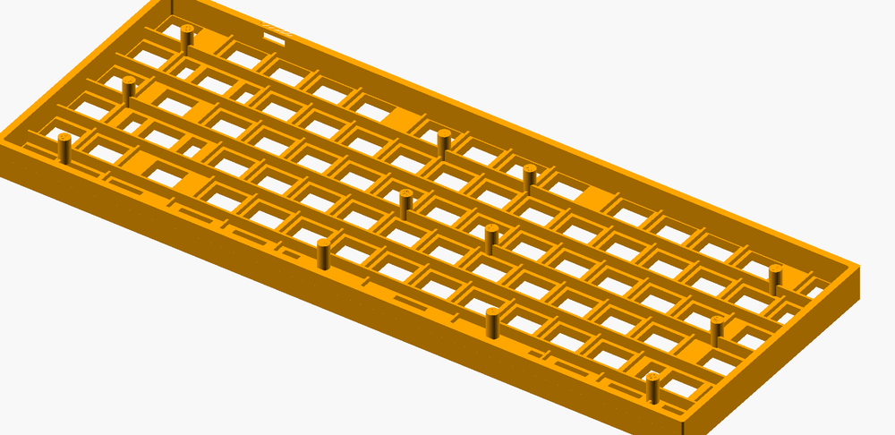

# keebcu - a customizer for 3d printable keyboard case

## Keyboard Customizer

This Keyboard Customizer for OpenSCAD is usable and you can customize your keyboard. But there are still some imperfections and "bugs". Please double check measurements and fittings of your keyboard layout.
You fist may print some critical parts for testing everything.
The available keyboard models (in stl directory) should work and have been printed by me on a Prusa Mini. I can not give any guarantee on the correct functionality of this script.

This is a remix of Parametric Cherry MX Mounting Plate for Mechanical Keyboards by rsheldiii
http://www.thingiverse.com/thing:573578

## Description
This is a OpenSCAD Script for custumizing a keyboard with a specific layout. It is designed to also show a simulation on how the keyboard could look like by adding keycaps from KeyV2 project by rsheldiii.

I designed the keyboard to be printable on smaller 3d printer build plates like Prusa Mini. Therefore, it is possible to configure where the keyboard should be cutted by the script with 'cutAfterUnits' variable. With this, it is possible to print a keyboard on smaller printers. The "smallTKL" design is the bigges layout I can print. If you have standard size printers like Prusa MK3 or Ender 3, etc, you may print normal TKL or even 100% layouts, eventually.
The cut will always be around the switch holes. This gives good stability when glueing the parts together. In theory, it should be possible to cut the keyboard into 3 or more parts. Therefore, new modules should be created and the pieces can be calculated by using difference function.

### Create you own keyboard layout
You can copy the file "template_to_copy.scad" and start configuring your own layout. By uncomment the module calls at the end of the layout file, it is possible to create each part like "rigth & left case", "rigth & left lid", and also risers. It is also possible to create the hole keyboard if you can print this big parts.

If you want to simulate the keyboard with keycaps and its colors, you can clone rsheldiii's KeyV2 Repository
( https://github.com/rsheldiii/KeyV2 ) in parallel to this repository (thisRepo/..).
The SCAD script will include "../KeyV2/includes.scad". So just put it into the right directory.
Keycap styles can be replaced in the module "KeyboardSim('layout','simulation true/false')" itself. See KeyV2 Wiki for available keycap profiles and documentation.

So if you want you can change the colors and have a look at how your keyboard may look!
You can add further keys into the array, but maybe the case will not fit automatically.
I will try to implement some more automatic functionalities as possible. (Or as long as I have fun with it :D).

The keyboard layout is defined in an array. In the template it is called "template_ansiUS_7583" for example.
It describes (in Units):
```
    [ [ [xPos (Column) , yPos (Row)] , key size (in Unit)], color ]
```

A unit is the size of the cutout for a cherry mx style switch. So a normal key would be 1u,
Backspace would be 2u or spacebar is for example 6.25u. The size of the cutout for the switch is defined as 'lkey'.

You need to configure 'hight' and 'width' of the case. These variables are necessary for calculating case sizes. Maybe this will be automated, as the information should be in the layout array.

### Printing advises
- Use brim for keyboard case. As there are many holes, the plate adhesion can be weak and the corners can rise up a little bit.
- Be careful with color changes. If color change is only at height of case stabilizer or screw holes, there can be problems when screwing on the lid.
- Notice that when placing in the switches, the keyboard case will bend (mid up, sides down) there is the variable 'switchHoleTolerance' which you can modifiy if needed.
- normally the lid parts do not need any brim.





### todo
- create selectable space (in y direction) between function row and next rows
- provide pcb cutout for teensy 2.0
- add delta variable for usb cutout and pcbholder to move it.
- function for iso layouts
- avoid case stabilizer for iso enter and numpad enter
- add cherry style stabilizer
- add scirting to case if needed


# LICENSE

<dl>
<a rel="license" href="http://creativecommons.org/licenses/by/4.0/"></a><br />Dieses Werk ist lizenziert unter einer <a rel="license" href="http://creativecommons.org/licenses/by/4.0/">Creative Commons Namensnennung 4.0 International Lizenz</a>.
</dl>

<dl>
<a rel="license" href="http://creativecommons.org/licenses/by/4.0/"></a><br />This work is licensed under a <a rel="license" href="http://creativecommons.org/licenses/by/4.0/">Creative Commons Attribution 4.0 International License</a>.
</dl>
