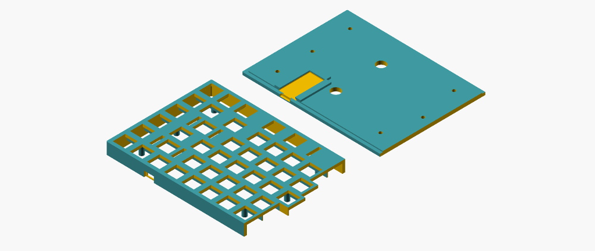
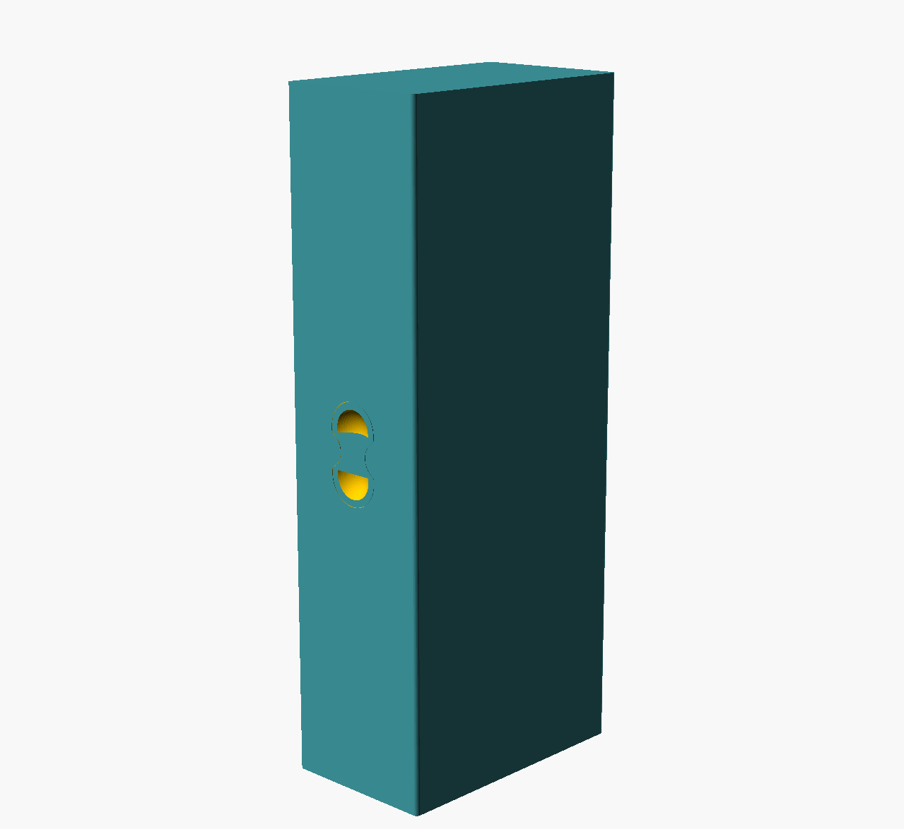
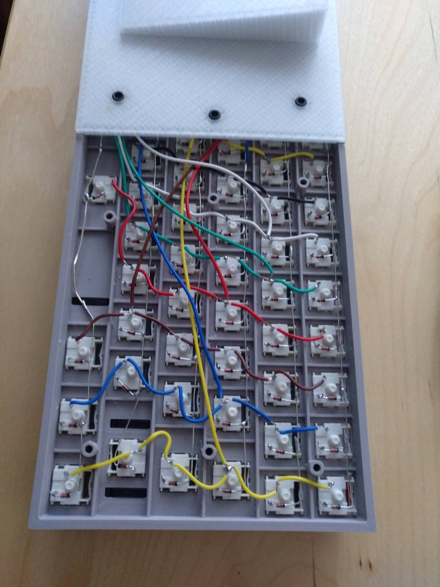

# keebcu - a customizer for 3d printable keyboard cases

## Keyboard Customizer

#### Notes
This Keyboard Customizer for OpenSCAD is in "usable" state now, and you can customize your keyboard :). But there are still some imperfections and "bugs". I'm testing several layouts, like normal sized boards to macro pads, etc., from time to time.

Please double check measurements and fittings of your keyboard layout. You first may print some critical parts for testing the model.
The available keyboard models (in stl directory) should work and have been printed by me on a Prusa Mini. I can not give any guarantee on the correct functionality of this script.

This is based on *Parametric Cherry MX Mounting Plate for Mechanical Keyboards* by rsheldiii
http://www.thingiverse.com/thing:573578

## Description
This is a OpenSCAD Script for custumizing a keyboard with a specific layout. It is designed to also show a simulation on how the keyboard could look like by adding keycaps from KeyV2 project by rsheldiii. **Download OpenSCAD and start building your keyboard ;)!**

I designed the keyboard to be printable on smaller 3d printer build plates like Prusa Mini. Therefore, it is possible to configure where the keyboard should be cut by the script with 'cutAfterUnits' variable. With this, it is possible to print a keyboard on smaller printers. The "smallTKL" design is the biggest layout I can print now. If you have standard size printers like Prusa MK3 or Ender 3, etc, you may print normal TKL or even 100% layouts, eventually :).
The cut will always be around the switch holes. This gives good stability when glueing the parts together. Before glueing, the parts may need some sanding work, etc. Just check that both sides fit to each other without bigger space in between.
(In theory, it should be possible to cut the keyboard into 3 or more parts. Therefore, new modules should be created and the pieces can be calculated by using difference function.)

I glued the parts together with Revell CONTACTA glue because of its fine needle which is very practical. Any plastic glue will work. I broke one of my prototype boards for testing and they are pretty stable if glued properly :). I had to use some force for it. Just be sure the case parts are glued well together!

### TL;DR usage
```
- clone this repo: git clone https://github.com/andimoto/keebcu.git
- get OpenSCAD (I used 2021.01 and 2019.05 as appImages on Linux).
- open the template_to_copy.scad file in OpenSCAD (or copy and rename it for your own custom layout)
- uncomment 'mainCase(<layout>)' line at the end of the file to check what your are doing
- start customizing your layout (place switch holes and set colors of your keycaps if you want)
- set screw holes where needed or add even more of them (think about the risers on the bottom)
- set usb and pcb values
- depending on your printbed size, set where to cut the keyboard case
- (optional) print critical parts of the case like space bar, parts with other stabilizers or usb and pcb area to test everything fits
- generate all necessary model files you want to print by uncomment the proper module call
- save and print!
```
### Current designs available
```
- andimoto7583
- andimoto6061 (not printed)
- andimoto_smallTKL
- andimoto_smallTKL_iso (printed)
- andimotoTKL (not printed)
- andimotoTKLiso (not printed)
```
```
Note:
7583 is -> 75% layout with 83 switches.
6061 is -> 60% layout with 61 switches
etc.
```

### Create you own keyboard layout
You can copy the file "template_to_copy.scad", rename it and start configuring your own layout. By uncomment the module calls at the end of the layout file, it is possible to create each part like "right & left case", "right & left lid", and also risers. It is also possible to create the whole keyboard itself in one piece if you can print bigger parts.

If you want to simulate the keyboard with keycaps and its colors, you can clone rsheldiii's KeyV2 Repository
( https://github.com/rsheldiii/KeyV2 ) in parallel to this repository (thisRepo/..).
The SCAD script will include "../KeyV2/includes.scad". So just put it into the right directory.
Keycap styles can be replaced in the module "KeyboardSim('layout','simulation true/false')" itself. See KeyV2 Wiki for available keycap profiles and documentation.

So you can change the colors and have a look at how your keyboard may look like!
You can add more keys into the array, but maybe the case will not fit automatically. Adjust height and width of the case, then.
I will try to implement some more automatic functionalities as possible.

The keyboard layout is defined in an array. In the template file it is called "template_ansiUS_7583" for example.
It describes (in Units):
```
    [ [xPos (Column) , yPos (Row)] , key size (in Unit), color ]
```

A unit is the size of the cutout for a cherry mx style switch. So a normal key is 1u,
Backspace is 2u or spacebar is for example 6.25u. The size of the cutout for the switch is defined as 'lkey'.

You need to configure 'hight' and 'width' of the case. These variables are necessary for calculating case sizes. Maybe this will be automated, as the information should be calculatable from the layout array.

After your layout is set you can adjust and modify the array 'screwHoleArray' to set the scew holes to the right place you want them to. The lid will also use this array, and thus, the screw holes will fit automaticaly to the case. The standard screw size is 3mm. The length depends on the case height, but I used 3x8mm screws.

It is also possible to modify the pcb dimensions with the 'pcb'-values. Available sizes for Arduino Pro Micro and Teensy2 are included. Just change the comments to select the right one. I recommend to measure your pcb anyway and check dimensions. You can also move the whole pcb and cutout for usb connection in X direction by setting 'pcbShift' with a positive or negative value.

Generating risers for the keyboard can be selected with true/false and adjusted in width and length/depth. The colors of the risers and of cource the case and lid can be set after the screw hole array, at the end of the layout file.

### Parts needed
- Printed Keyboard Parts
  - Case
  - Lids
  - Risers
- Cherry MX Style switches
- Fancy Keycaps
- Costar Stabilizers
- Screws 3x8mm

### Assembly
- use sandpaper and a scalpel to clear the surface where parts get glued together. Double check if parts does not block each other.
- glue the two case parts together carefully. Place them on a flat surface and put some books on each side, then put some glue into the rills.
- wait until it is dry and put some more glue on it if needed.
- after some drying time you can put in the switches (it is possible that this will bend the keyboard)
- solder switches and diodes together (electronics will be documented later)
- solder the controller onto the keyboard matrix and place the pcb inside the pcb holder of the lid.
- flash and test your firmware
- screw all parts together and place the risers if you need them (I recommend gluing the risers on the lids and then assembly them to the case)
- have fun with your keyboard ;)


### Printing advises
- Use brim for keyboard case. As there are many holes, the plate adhesion can be weak and the corners can rise up a little bit.
- Be careful with color changes. If color change is only at height of case stabilizer or screw holes, there can be problems when screwing on the lid. I broke the top part of the scrw cylinder where the color change had no good adhesion the other layers. I recommend to do the color change at the last layer of the keyboard cases plate. (See pics/pics/keebcu_016.JPG)
- Notice that when placing in the switches, the keyboard case will bend (mid up, sides down) there is the variable 'switchHoleTolerance' which you can modifiy if needed.
- normally the lid parts do not need any brim.

## todo
- create selectable space (in y direction) between function row and next rows
- provide pcb cutout for teensy 2.0 (DONE)
- add delta variable for usb cutout and pcbholder to move it. (DONE)
- avoid case stabilizer for iso enter and numpad enter (optional)
- add cherry style stabilizer!
- add a selectable skirt to the case
- add parametric keebCase (already working on)
- screw holes get crossed by case stabilizer (DONE)
- documentation for keebCase.scad
- add build scripts
- test other keyboard layouts like random stuff or ten keys

## Wrist rest and Keyboard Case
For each keyboard a wrist rest can be created with the model file wrist.scad. The stl-directory contains a wrist rest for each keyboard which can be printed as you want.
For transportation I designed a case which can be customized in size to fit your keyboard. The case has placeholders for little magnets and gets locked by some kind of bones :).

__Attention: The Keyboard case is still in development state. I just printed some smaller prototypes. But it fits well so far. Need to check magnets.__


## Firmware
For firmware please see https://github.com/andimoto/qmk_firmware/tree/andimoto/andimoto-7583-promicro-new/keyboards/andimoto

The qmk_firmware fork contains everything to build the firmware for the provided boards *andimoto7583* and *andimoto_smallTKL*.

**Attention: The Pro Micro is "normally" suited for layouts with up to 65 switches. I was lazy and did not want to modify the pcb cutout to fit in the teensy 2.0 at that time. So I removed both TX/RX Leds from the pro micro and had 2 extra pins available (pcb may be damaged!!). This enables layouts with up to 84 switches :). Also qmk_layout needs to be squeezed together.**

*I will also add a schematic for soldering the keyboard matrix and the Pro Micro of the available boards.*

The Arduino Pro Micro clones are very cheap so I used them. More money for fancy keycaps ;).

## Model Gallery
*andimoto7583*


*andimoto smallTKL iso*


*andimoto smallTKL*


*andimoto smallTKL_iso*


*andimoto6061*


*andimotoTKL*


*andimotoTKLiso*








### Reality





# LICENSE

<a rel="license" href="http://creativecommons.org/licenses/by-sa/4.0/"></a><br />Dieses Werk ist lizenziert unter einer <a rel="license" href="http://creativecommons.org/licenses/by-sa/4.0/">Creative Commons Namensnennung - Weitergabe unter gleichen Bedingungen 4.0 International Lizenz</a>.

<a rel="license" href="http://creativecommons.org/licenses/by-sa/4.0/"></a><br />This work is licensed under a <a rel="license" href="http://creativecommons.org/licenses/by-sa/4.0/">Creative Commons Attribution-ShareAlike 4.0 International License</a>.
